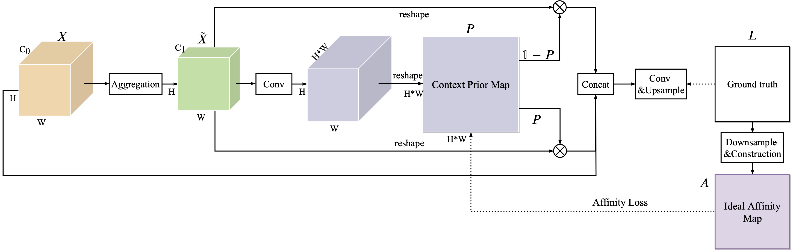
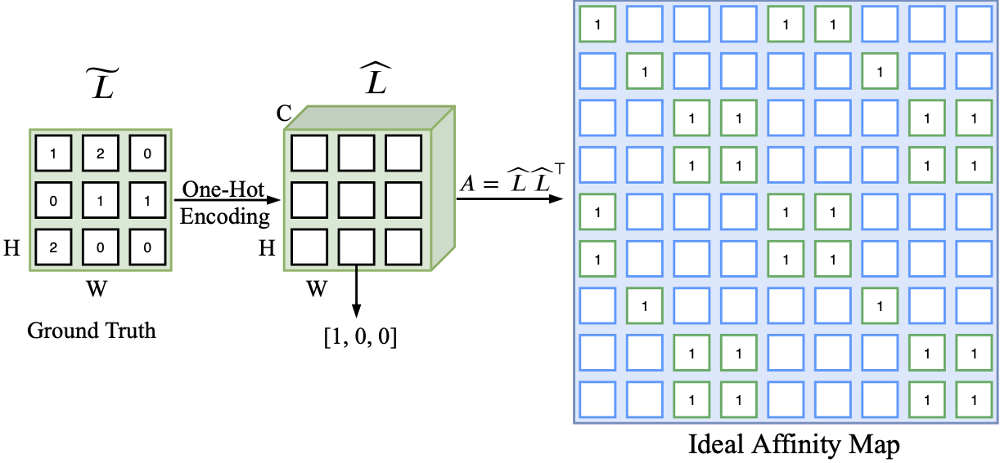
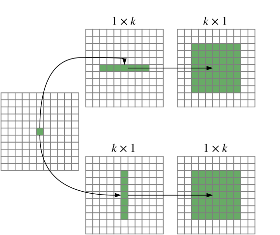
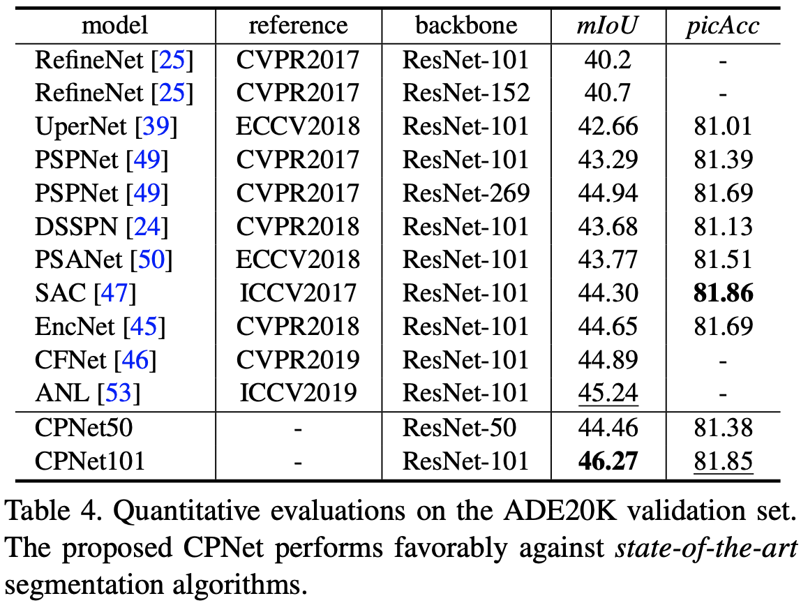
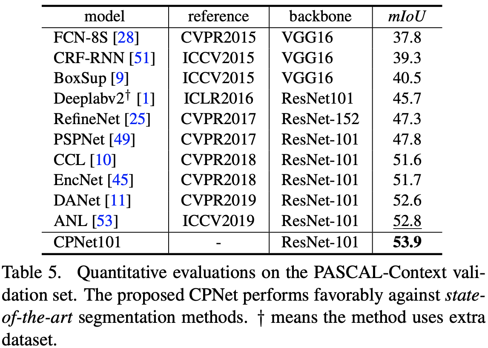
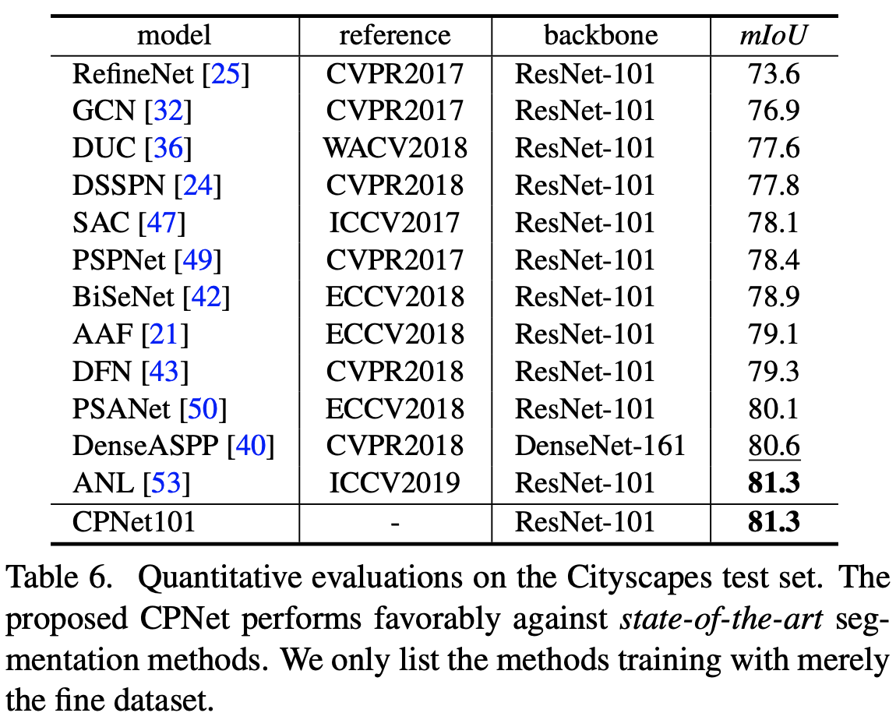

# Context Prior for Scene Segmentation (CVPR2020)
Implementation for **[CPNet](https://arxiv.org/abs/2004.01547)**.

[](https://paperswithcode.com/sota/semantic-segmentation-on-ade20k?p=context-prior-for-scene-segmentation)

[](https://paperswithcode.com/sota/scene-understanding-on-ade20k-val?p=context-prior-for-scene-segmentation)

[](https://paperswithcode.com/sota/semantic-segmentation-on-pascal-context?p=context-prior-for-scene-segmentation)

[](https://paperswithcode.com/sota/semantic-segmentation-on-cityscapes?p=context-prior-for-scene-segmentation)



 | 
:-------------------------:|:-------------------------:
## News
- A simple version of the core codes has been released. It is based on mmsegmentation. You can integrate the codes into mmseg to run the experiments. Recently I am busy with job hunting and PhD thesis. After this peroid of time, I will release the complete version.
- We achieve **46.3%** mean IoU on ADE20K *val* set, **53.9%** mIoU on PASCAL-Context, and **81.3%** mIoU on Cityscapes.

## Performance
||
:-------------------------:|:-------------------------:|:-------------------------:

## Citation
Please consider citing the ContextPrior in your publications if it helps your research. 
```
@inproceedings{Yu-CVPR-ContextPrior-2020,
  title={Context Prior for Scene Segmentation},
  author={Yu, Changqian and Wang, Jingbo and Gao, Changxin and Yu, Gang and Shen, Chunhua and Sang, Nong},
  booktitle={Proceedings of the IEEE Conference on Computer Vision and Pattern Recognition (CVPR)},
  year={2020},
}
```
